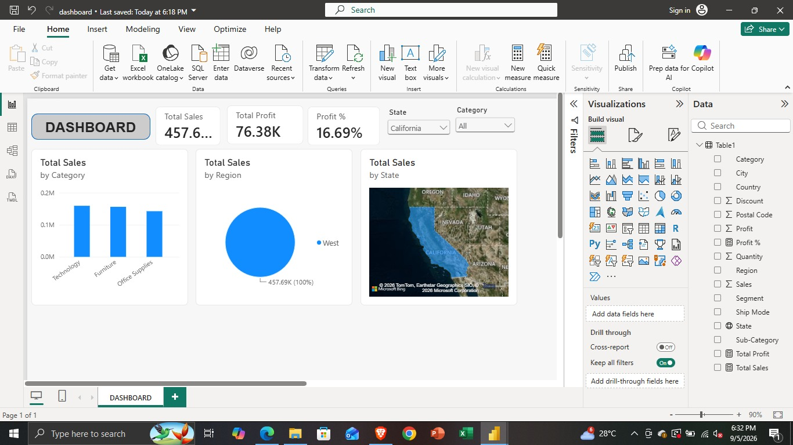

# 🛒 Superstore Sales Dashboard - Power BI

### 📊 Project Overview
Built an interactive sales dashboard to analyze Superstore sales data with dynamic state filtering.

### 🔥 Key Metrics (All States)
- **Total Sales:** 2.30M
- **Total Profit:** 286.40K
- **Profit %:** 12.47%

### 💡 Key Insights Found
- **Best State:** California - 457.6K Sales, 16.69% Profit (Highest)
- **Loss State:** Arizona - 35.28K Sales, -9.72% Loss
- **Best Region:** West - 725.46K (31.58%)
- **Top Category:** Technology

### ⚙️ Features
- State & Category Slicers (Interactive Filtering)
- Filled Map Visual for State-wise Sales
- Bar Chart - Sales by Category
- Pie Chart - Sales by Region
- KPI Cards

### 🛠️ Tools Used
Power BI Desktop, DAX (Total Sales, Total Profit, Profit %)

### 📸 Dashboard Preview

---
Created by Bhupendra Singh
